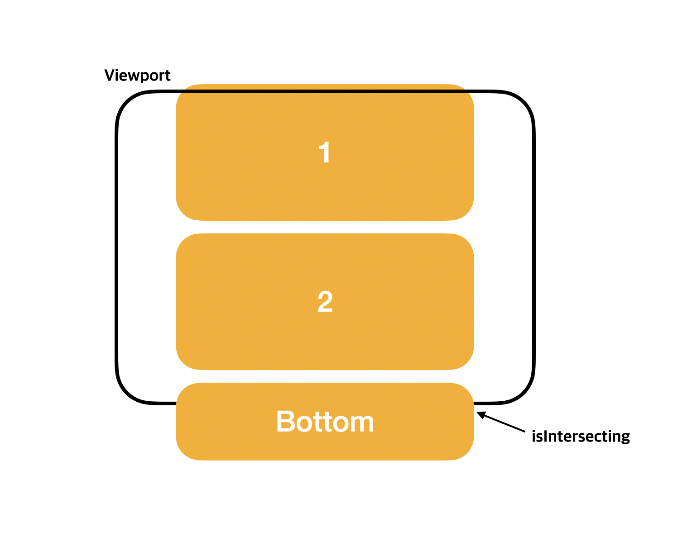

## 소개

무한 스크롤은 사용자가 페이지를 아래로 스크롤 할 때 콘텐츠를 지속적으로 로드 하는 기술이다. `Pagenation`과 비슷하지만 모바일에 특화된 기술이라고 볼 수 있다.
스크롤을 내리며 화면의 끝에 닿으면 비동기 적으로 콘텐츠를 로드하고, 이는 사용자 경험을 향상시켜준다.

무한 스크롤을 구현하는 방법에는 여러가지 방법이 있다. 전통적인? 방법은 `scroll` 윈도우 객체 또는 특정 `div`에 eventListenr를 추가하고, `div`가 화면 끝에 닿았을 때 data를 새로 로드하는 방식이다.

```JavaScript
function InfiniteScroll () {
    const fetchData = async () => {
        // api logic
    };

    const handleScroll = () => {
    const { documentElement } = document
    const scrollHeight = documentElement.scrollHeight;
    const scrollTop = documentElement.scrollTop;
    const clientHeight = documentElement.clientHeight;
    if (scrollTop + clientHeight >= scrollHeight) {
        fetchData
     }
    };

    useEffect(() => {
    window.addEventListener("scroll", handleScroll);
    return () => {
        window.removeEventListener("scroll", handleScroll);
     };
    },[]);
}
```

코드로 작성하면 이런 느낌이 될 것 같다.
분명 이 방법도 나쁘진 않다. 코드가 복잡하지 않고, 간단하게 infinite Scroll의 구현이 가능하다. <br/>
다만, `scroll` 이벤트 이벤트가 수백번 호출되고, UI스레드(메인스레드)에 영향을 준다. 감지하는 이벤트가 끊임없이 호출되기 때문에 성능에 영향을 주는 것이다.
이런 단점을 상쇄하려면 `Debounce`(함수를 그룹핑), `throttling` (200ms에 한번 감지한다던지)로 문제를 해결할 수 있다. 뭔가 일을 더 키우는 것 같아서 더 좋은 방법이 없을까 찾아보았다.

## Intersection Observer

대안으로 사용할 `Intersection Observer` 이다. 여타 다른 블로그에서 소개 하고 있고, 나 또한 공감해서 이를 발전 시켜 `Infinite Scroll Util`을 생성해보았다.

[Intersection Observer](https://developer.mozilla.org/ko/docs/Web/API/IntersectionObserver/IntersectionObserver)

<blockquote>
 <p> 대상(target) 으로 칭하는 요소가 기기 뷰포트나 특정 요소와 교차하는 것을 감지한다.</p>
 </blockquote>

이 특성을 이용해서 페이지의 끝에 겹쳐지는 부분을 감지할 element를 생성하고 element가 화면에 노출되면 새로운 데이터를 불러온다.

먼저, `useTargetObserver`이라는 Custom Hook을 생성한다. target을 `IntersctionObserver`로 감지해서 root(viewport)와 겹치면 `isInterseting` 이 true로 변경된다.

```typescript
import React, { useEffect, useState } from 'react';

const defaultOptions: IntersectionObserverInit = {
  threshold: 0.3,
};

export function useTargetObserver<T extends Element>(
  customOptions?: IntersectionObserverInit,
  target?: React.RefObject<T>,
): boolean {
  const option = {
    ...defaultOptions,
    customOptions,
  };
  const [isIntersecting, setIntersecting] = useState(false);
  const observer = new IntersectionObserver((entries: IntersectionObserverEntry[]) => {
    setIntersecting(entries[0].isIntersecting);
  }, option);

  useEffect(() => {
    if (target?.current) {
      observer.observe(target.current);
    }

    return () => {
      observer.disconnect();
    };
  }, [observer, target]);

  return isIntersecting;
}
```



이렇게 감지된다고 보면 된다.

이 것을 활용한 Infinite Scroll Component를 생성해보자

### Common component

```javascript
interface InfiniteScrollProps {
  children: ReactNode;
  trigger: () => void;
  pageNumber: number;
  totalPageCount: number;
  isLoaded: boolean;
}

export const InfiniteScroll = (props: InfiniteScrollProps) => {
  const { pageNumber, totalPageCount, trigger, isLoaded } = props;

  const target = useRef < HTMLDivElement > null;
  const isIntersecting = useTargetObserver < HTMLDivElement > ({ threshold: 1 }, target);

  const needMoreList = totalPageCount > pageNumber;

  useEffect(() => {
    if (isIntersecting && needMoreList) {
      trigger();
    }
  }, [isIntersecting, needMoreList]);

  return (
    <>
      {props.children}
      {isLoaded && needMoreList && <div ref={target} />} // loading or bottom element
    </>
  );
};
```

### 사용부

```javascript
const SampleList = () => {
  const dispatch = useDispatch();

  const { pageNumber, totalPageCount } = useSelector(selector);
  const list = useSelector(list);

  useEffect(() => {
    dispatch(fetch());

    return () => {
      dispatch(clear());
    };
  }, []);

  return (
    <InfiniteScroll
      isLoaded={list.length !== 0}
      pageNumber={pageNumber}
      totalPageCount={totalPageCount}
      trigger={() => dispatch(fetch())}
    >
      {list.map((item) => (
        <div>{item}</div>
      ))}
    </InfiniteScroll>
  );
};
```

활용을 높이기 위해 Component를 생성하고 Component에 list등 원하는 data를 children으로 넘겨주면 작동하게 제작해보았다.
Infinite Scroll에 사용되는 pageNumber, totalPageCount등은 Api 구현에 따라 달라지므로 완벽히 들어맞을 수는 없다. 용도에 맞게 사용하면 된다.

## 생각할 거리..

페이스북이나 인스타그램을 보면, 화면의 끝에 닿았을 때 호출되는 것이 아니라 더 이른 시점에 데이터를 로드하는 것을 볼 수 있다. 그렇다면 그건 ScrollHeight를 계산해서 발생시키는 것이라고 생각되는데..
그 방법이 사용자 관점에서는 정말 무한 스크롤의 취지에 맞는 것 같다는 생각도 든다.

오늘은 여기까지!

## Reference

https://velog.io/@yeonseo07/infinite-scroll
https://heropy.blog/2019/10/27/intersection-observer/
https://developer.mozilla.org/ko/docs/Web/API/IntersectionObserver/IntersectionObserver
